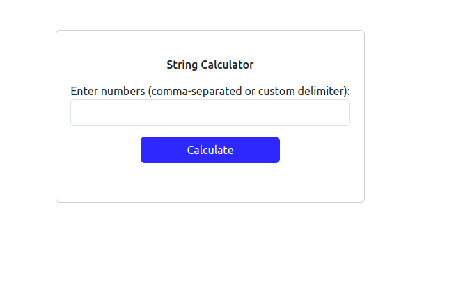
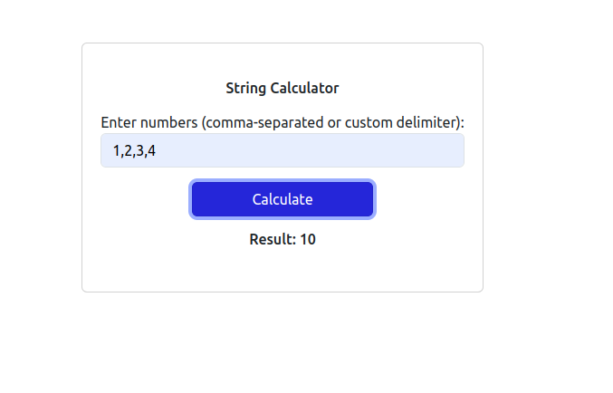
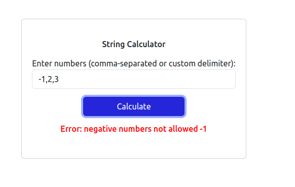
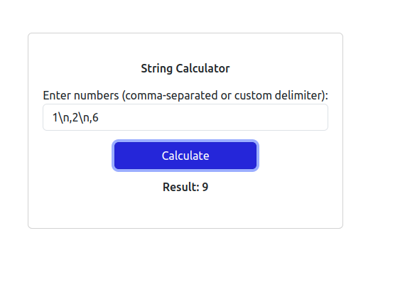

## String Calculator App

This repository contains a full-stack string calculator application built using Ruby on Rails for the backend and Rails views for the frontend. The application allows users to input a string of numbers (comma-separated or with a custom delimiter) and calculates their sum. The backend processes the string and handles validation, while the frontend provides a simple interface for interaction.It also contains backend api for same functionality to be called from react front end.

## Features

- **Add Numbers:** Users can input a string of comma-separated numbers, and the app will return the sum.
- **Supports Empty Strings:** An empty string returns a sum of `0`.
- **Validation for Negative Numbers:** If the user input contains negative number it will return with error message.

## Requirements

- Ruby 3.0.0
- Rails 7.1.5.1
- Node js version- 16.20.2

## Installation

Follow these steps to get the app running locally.
### 1. Clone the Repository

- **Backend Repo**

`git clone https://github.com/PrachitiMhatre/string_calculator.git`

`cd string_calculator`

- **Frontend Repo**

`git clone https://github.com/PrachitiMhatre/string-calculator-react.git`

`cd string-calculator-git`

### 2. Install Dependencies

Make sure you have Ruby and Rails installed on your machine. Then, install the required gems:

`bundle install`

### 3. Run the Application

- **Backend**

Start the Rails server:

`rails s`

- **Frontend**

Start the npm server

`npm start`

By default, the app will be accessible at http://localhost:3000.

### 4. Access the Application

- **Frontend**
Open your browser and go to http://localhost:4000.

- **Backend**
Open your browser and go to http://localhost:3000.

## Usage

Basic String Calculation

Enter a string of comma-separated numbers and click "Calculate" to get the sum.

Example:

Input: 1,2,3

Output: 6

Empty String

An empty string returns 0:

Input: ""

Output: 0

## Testing

Run the test suite with RSpec:

`bundle exec rspec`

## Screenshot

Here is a screenshot of the application:

